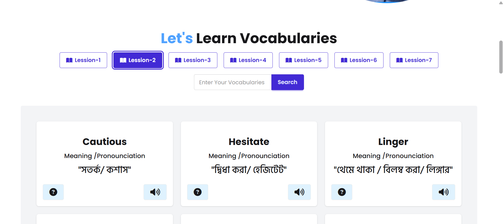

# 📘 English Janala

An interactive vocabulary learning web application built with HTML, Tailwind CSS, and JavaScript.

---

## 🚀 Live Demo

🔗 Live Site: https://harunbappi.github.io/English-Janala/

---

## 📸 Project Screenshot

---

## ✨ Features

- 📚 Dynamic lesson loading from API
- 🔊 Word pronunciation using SpeechSynthesis API
- 🎯 Responsive grid layout
- ⚡ Interactive UI with Tailwind & DaisyUI
- ❌ Error handling for empty lessons

---

## 🛠️ Technologies Used

- HTML5
- Tailwind CSS
- DaisyUI
- JavaScript (ES6)
- Fetch API
- SpeechSynthesis API

